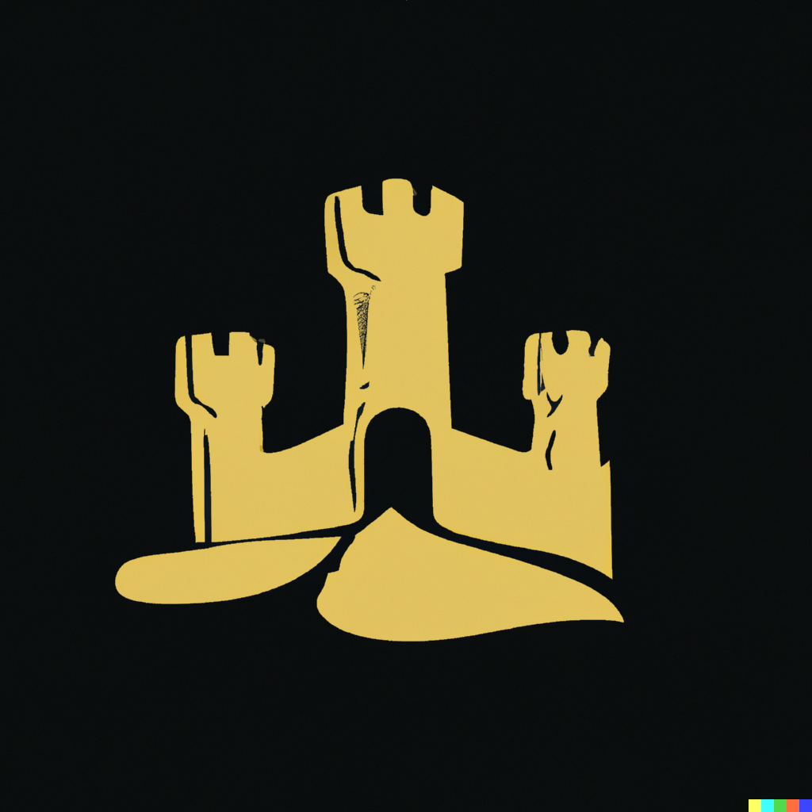

# Castle

_So far it is absolutely nothing_

Logo by DALLE 2 by OpenAI

## Dependencies

`GNU make, go ^1.19`

## Building castle

`make` - Builds castle for local OS

`make windows` - Builds castle for windows

`make install` - Builds castle and copies to `/usr/local/bin/castle`. Linux only.
Requires sudo.

`make clean` - Removes dist directory and `/usr/local/bin/castle`.

## Testing

`make test`
